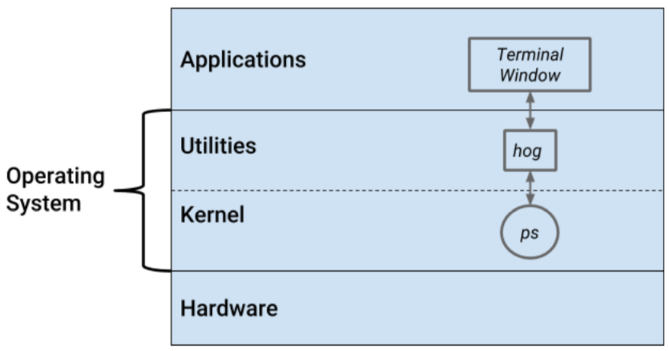

# Detailed Design Document

Serena Zafiris, Donovan Moini, Ian Lizarda

## Linux Modules that will be modified or affected
While no module will be directly modified or affected, a utility later will be added to ​`ps​` for additional functionality. This new layer that will allow users to search for the top *​n​* processes using up the CPU or all the processes using *​p​* percentage or more of the CPU.

## New Modules Created
While no new modules will be created, we will be adding a utility layer to `p​s​` called `hog`.​ The command `​hog`,​ when provided with the correct arguments, returns either the top ​*n​* process using the greatest amount of the CPU or all the processes using ​*p​* percentage or more of the CPU.

## Class Diagram of Affected Modules and New Modules

## Command Line Options
`hog​ [-p] n`
- **p** = argument that asks for a minimum usage requirement to show up in the list
  - `hog -p 25​` would return programs that use at least 25% of the CPU
- **n** = argument to restrict the list itself. If preceded by ​`-p`,​ ​*n​* refers to the programs using up *n*​ ​percentage or more of the CPU. If *n​* is the sole argument, *n​* ​refers to the top ​*n​* programs using up the CPU.